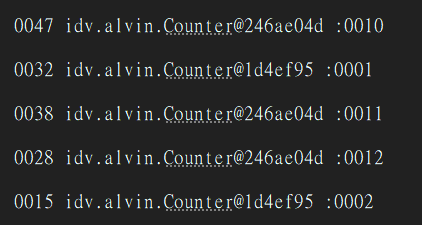

==== 介紹Singleton

* 先了解一下JVM怎麼建立物件
1. 分配記憶體的空間
2. 將分配到的記憶體的空間(記憶體的空間的地址)給予實例workerInstance
(workerInstance 不再是null了)
3. 將值寫入workerInstance

[source,java]
----

public class MyWorker {

  private int workerNumber;

  public MyWorker (int workerNumber) {
    this.workerNumber = workerNumber;
  }

  public int getWorkerNumber () {
    return workerNumber;
  }

}

public class Main{
    public static void main(String[] args){
    MyWorker workerInstance = new MyWorker (1);
    }
}
----

所以在JAVA中我們要建造 *唯一* 一個物件的時候，我們該怎麼做?

這時候Single pattern是一個很好的方式

.Step1
[source,java]
----
@Getter
public class Counter{

    private Integer count;

    private Counter(){
        this.count=0;
    }

    public void add(){
        count++;
    }

}

----

.Step2
[source,java]
----
@Getter
public class Counter {

  private Integer count = 0;

  private Counter() {

  }

  public Counter getInstance() {
    return new Counter();
  }

  public void add() {
    count++;
  }
}
----

.Step3
[source,java]
----
@Getter
public class Counter {

  private Integer count;

  private Counter() {
    this.count = 0;
  }

  public static Counter getInstance() {
    return new Counter();
  }

  public void add() {
    count++;
  }
}
----

.Step4
[source,java]
----
@Getter
public class Counter {

   private static Counter uniqueInstance;
  private Integer count;

  private Counter() {
    System.out.println("init counter");
    this.count = 0;
  }

  public static Counter getInstance() {
    if (uniqueInstance == null) {
      uniqueInstance = new Counter();
    }
    return uniqueInstance;
  }

  public void add() {
    count++;
  }
}

public class Main {

  public static void main(String[] args) {

    IntStream.range(0, 100).parallel()
        .forEach(ele -> {
          Counter counter = Counter.getInstance();
          System.out.println(counter + ":" + counter.getCount());
          counter.add();
        });
  }
}
----

. 這是lazy loading 只有在getInstance被call至少一次 才會去創建uniqueInstance 如果從頭到尾沒有人call過 那uniqueInstance就不會被創建 省時間空間

. 這份code在大多數情況可以 但如果是multi-thread的話 有可能thread1在if condition過了以後在創建實體的同時有另一個thread2進來 這樣就爆了 生出兩個instance

.建立了一堆物件
image::../images/chapter2/image-2024-04-24-23-40-56-795.png[]

那麼這時候你應該會記得當初學到的關鍵字synchronized

.Step5
[source,java]
----
@Getter
public class Counter {

  private static Counter uniqueInstance;
  private Integer count;

  private Counter() {
    System.out.println("init counter");
    this.count = 0;
  }

  public static synchronized Counter getInstance() {
    if (uniqueInstance == null) {
      uniqueInstance = new Counter();
    }

    return uniqueInstance;
  }

  public synchronized Integer add() {
    return count++;
  }
}
----

.似乎有照預想的執行了
image::../images/chapter2/image-2024-04-25-19-59-15-828.png[]

但是其實synchronized是一個效率很低的方法而，而且非常的吃資源，因為裡面只有一個執行緒能夠執行

那麼還有一個較為簡易的方法

[source,java]
----

private static Counter uniqueInstance = new Counter();
----

JVM會在系統啟動時，便先建立好這個類別變數，但這樣會造成一個問題便是，如果都沒有人使用，那麼則會造成資源的浪費

那麼最佳解則是，當我們想要使用的時候，發現他還沒有被建立則建立，反之則使用原本的類別物件，且不用綁死synchronized

[source,java]
----
public class Counter {

  private static Counter uniqueInstance ;
  private Integer count;

  private Counter() {
    System.out.println("init counter");
    this.count = 0;
  }

  public static Counter getInstance() {
    if(uniqueInstance == null){
      synchronized(Counter.class){
        uniqueInstance = new Counter();
      }
    }
    return uniqueInstance;
  }

  public synchronized Integer add() {
    return ++count;
  }

}
----

.還是出意外了

以上程式的部分是指進去getInstance，先不用getInstance綁住，當發現uniqueInstance是NULL的時候，才block住

這樣還是會有race condition的問題 如果第一個thread正要new的時候 第二個thread到if 發現沒東西 進if condition 要synchronized之前 第一個thread因為還在生所以第二個thread被block住 第一個thread生完後release lock 換第二個thread進場new 那這樣就會有兩個

解法就是當第二個thread拿到鎖之後(也就是synchronized裡) 再確認一次instance還是不是null

[source,java]
----
public class Counter {

  private static Counter uniqueInstance ;
  private Integer count;

  private Counter() {
    System.out.println("init counter");
    this.count = 0;
  }

  public static Counter getInstance() {
    if(uniqueInstance == null){
      synchronized(Counter.class){
        if(uniqueInstance == null){
          uniqueInstance = new Counter();
        }
      }
    }
    return uniqueInstance;
  }

  public synchronized Integer add() {
    return ++count;
  }
}
----

就是當thread1正在new的時候 他有可能先跟記憶體allocate了一些空間後 才開始執行constructor(建這個Singleton instance需要的東西) 所以有可能thread1還在跑constructor的時候thread2進到第一個if發現不是null 就直接回傳給別人 別人就直接開始用 但是thread1根本就construct到一半而已

這時候只需要把這個instance加一個精美的關鍵字 volatile

[source,java]
----
public class Counter {

  private volatile static Counter uniqueInstance ;
  private Integer count;

  private Counter() {
    System.out.println("init counter");
    this.count = 0;
  }

  public static Counter getInstance() {
    if(uniqueInstance == null){
      synchronized(Counter.class){
        if(uniqueInstance == null){
          uniqueInstance = new Counter();
        }
      }
    }
    return uniqueInstance;
  }

  public synchronized Integer add() {
    return ++count;
  }

}
----

volatile通常出現在multi-threading的code裡面 代表著這個變數很不穩定 加上這個變數之後給了我們兩個保證

1.對於這個變數的寫 會保證寫進memory(所以其他thread會看到最新的值) 對於這個變數的讀 會保證從memory讀

2.JVM 跑compiler optimization的時候 不可以隨便改變volatile變數的順序

*Singleton*

保證一個class只會有最多一個instance 同時提供一個存取方法

或者是寫成以下方法

[source,java]
----
public class Counter {

  private Integer count;

  private Counter() {
    System.out.println("init counter");
    this.count = 0;
  }

  private static final class UniqueInstanceHolder {

    private static final Counter uniqueInstance = new Counter();
  }

  public static Counter getInstance() {
    return UniqueInstanceHolder.uniqueInstance;
  }

  public synchronized Integer add() {
    return ++count;
  }

}
----

==== 回到主題用Enum實作Singleton

經過上述講解，在開始前稍微說一下

.常見的第一個方法 eager-loading
[source,java]
----
public class Elvis {
public static final Elvis INSTANCE = new Elvis();

  private Elvis() {
  }

  public void leaveTheBuilding() {
    System.out.println("Whoa baby, I'm outta here!");
  }
}
public static void main(String[] args) {
  Elvis elvis = Elvis.INSTANCE;
  elvis.leaveTheBuilding();
}
----

.常見的第二個方法 靜態工廠
[source,java]
----
public class Elvis {
private static final Elvis INSTANCE = new Elvis();

  private Elvis() {
  }

  public static Elvis getInstance() {
    return INSTANCE;
  }

  public void leaveTheBuilding() {
    System.out.println("Whoa baby, I'm outta here!");
  }
}
public static void main(String[] args) {
  Elvis elvis = Elvis.getInstance();
  elvis.leaveTheBuilding();
}
----

.最簡單的方法
[source,java]
----
enum Suit
{
    CLUB, SPADE, HEART, DIAMOND;

    private Suit()
    {
        System.out.println("Constructor called for : " +
        this.toString());
    }
    public void suitInfo()
    {
        System.out.println("Universal Suit");
    }
}
public static void main(String[] args) {
  Suit s1 = Suit.CLUB;
  System.out.println(s1);
  s1.suitInfo();
}
----

你可以把enum 想成以下的樣子

[source,java]
----
Class Suit
{
    public static final Suit CLUB = new Suit();
    public static final Suit SPADE = new Suit();
    public static final Suit HEART = new Suit();
    public static final Suit DIAMOND = new Suit();
}
----

那麼只有在enum在被呼叫的時候，才會被call 建構子
[source,java]
----
enum Suit
{
    CLUB, SPADE, HEART, DIAMOND;

    private Suit()
    {
        System.out.println("Constructor called for : " +
        this.toString());
    }
    public void suitInfo()
    {
        System.out.println("Universal Suit");
    }
}

public class Test
{
    public static void main(String[] args)
    {
        System.out.println("1234");
        Suit s1 = Suit.CLUB;
        System.out.println(s1);
        s1.suitInfo();
    }
}
----

image::../images/chapter2/image-2024-04-25-20-47-39-189.png[]

而且enum還支援序列化